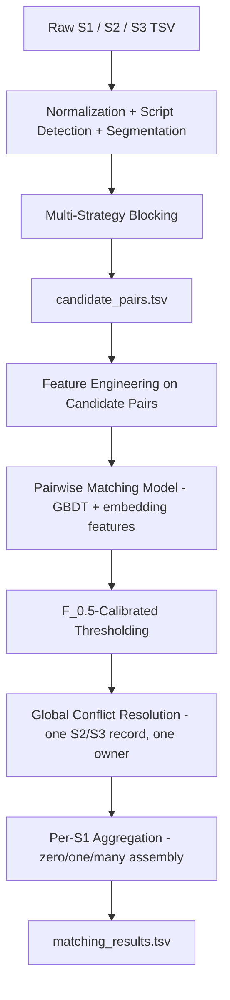

# Business Entity Resolution — Approach & Architecture Design

**Status:** Strategy document, updated after inspecting a 162-row sample of `train_ground_truth.tsv`. This is *not* the final `Documentation_template.md` submission (that requires real F_0.5 numbers and error analysis). Purpose here is to lock in the architecture and defend every choice against the constraints and the observed data, then build against it.

---

## 1. Constraints at a Glance

| Constraint | Detail | Design implication |
|---|---|---|
| Metric | F_0.5, macro-averaged **per Source 1 entity**, singletons included | Precision is worth 2× recall — every stage should default to "don't merge" when unsure |
| Scale | Test has **1,732,544 S1 records and 9,969,589 S2/S3 records**; the S2/S3 pool is the expensive side | Blocking must be streaming/disk-backed and sub-quadratic; a 50–100 candidate cap can still create 86–173M pair evaluations |
| Open-set country | Test adds **France**, unseen in training | Nothing can be trained/tuned to depend on a fixed country vocabulary |
| Fair play | No external DBs, APIs, geocoders, or internet augmentation | Any lookup table (abbreviation maps, transliteration schemes) must be hand-built or derived only from the provided data |
| Model constraint | Final model ≤ 8B params, MIT/Apache-2.0 licensed | Applies to any *pretrained* component (embedding model, reranker); a GBDT trained from scratch on the provided data carries no license/param issue at all — flagged as an assumption to confirm with organizers if ambiguous |
| Output | Two TSVs, strict format, `candidate_pairs.tsv` must be the *exact* pre-inference candidate set | Matching-model input and blocking output must literally be the same object, not regenerated separately |

---

## 2. Data Profile

### 2.1 Field/noise characteristics (from record samples reviewed)

| Source | Character | Implication |
|---|---|---|
| **S1** (reference) | Clean legal names, consistent address components (street, city, state, PIN mostly present) | Reliable anchor for building any lookup dictionary (suffix lists, token vocab) — this is legitimate "provided training data," not external augmentation |
| **S2** | Meaningful share of names in **native script** (Devanagari, Tamil, Bengali) — sometimes as the *only* name; addresses mix native-script state/city tokens into otherwise-English strings; cosmetic noise (`~` prefix, `[INCORPORATED]`/`[PC]` suffixes, appended URLs, double spaces) | Needs multilingual handling, not just Latin normalization; suffix/URL stripping via regex |
| **S3** | **Concatenated domain-style names** with no whitespace (`wilfordhancock.com`); adversarial-looking char noise (`Léarning`, `Sgpeciarity`, `N0se`); token duplication/injection (`Chinglepet Private Limited Center`); large fraction with **no address at all**; mixed-script names | Needs word-segmentation preprocessing; token-set similarity should outweigh edit-distance; address can't be relied on for blocking |
| All three | `country` looks reliably populated even on garbled rows | Safe to use as a soft blocking/feature signal, but must stay an open string set (no hardcoded `{US, India}`) |

### 2.2 Ground-truth statistics

The initial 162-row sample was useful for forming hypotheses, but the complete `train_ground_truth.tsv` is available and supersedes those sample-only values:

| Statistic | Full training value |
|---|---|
| Source 1 rows | 2,206,821 |
| Singleton rate | 123,247 / 2,206,821 = **5.58%** |
| Total matched IDs | **7,638,365** |
| Mean matches per S1 | **3.46** |
| Maximum matches per S1 | **11** |
| S2 / S3 matched IDs | **3,693,619 / 3,944,746** |
| S1 entities with both S2 and S3 | **1,776,047 / 2,083,574 non-singletons = 85.2%** |
| Matched S2/S3 ID reused across S1 rows | **0** |

The complete source sizes are 2,206,821 / 5,034,616 / 5,285,603 for training S1/S2/S3 and 1,732,544 / 4,887,273 / 5,082,316 for test S1/S2/S3. Test S1 includes 259,452 France records, while France is absent from training.

The original sample table below is retained as historical context only. It must not be used to size the production pipeline or to claim final validation performance.

| Statistic | Value |
|---|---|
| Singleton rate (0 matches) | **9/162 = 5.6%** — much lower than a "don't neglect singletons" warning might suggest; singletons are the minority case here, not the bulk |
| Match-count distribution | 0:9, 1:10, 2:27, 3:35, 4:34, 5:30, 6:11, 7:6 — roughly bell-shaped, centered around 3–4 |
| Mean matches per S1 (all rows) | 3.48 |
| Mean matches per S1 (non-singletons only) | 3.68 |
| Max matches observed | 7 |
| S2 vs S3 share of all matched IDs | 48.5% / 51.5% — near-even, neither source dominates |
| S1 entities with matches in **both** S2 and S3 | 130/153 non-singleton rows (**85%**) |
| S1 entities matching **S2 only** | 11 |
| S1 entities matching **S3 only** | 12 |
| Matched ID reused across more than one S1 row | **0 of 563** matched IDs in the sample |
| Entity-ID structure | Numeric suffixes look randomly distributed (not sequential/meaningful) — confirms IDs carry no blocking signal beyond the source prefix |

Two of these findings materially change the architecture (detailed in the new Stage F below):

- **Low singleton rate + zero cross-S1 ID reuse** together suggest the true matching structure is closer to a **functional mapping from the S2/S3 side** (each S2/S3 record belongs to at most one real-world business, hence at most one S1 entity) than to independent, unconstrained pairwise decisions. That's a strong structural prior worth exploiting directly, not just an emergent property to hope the classifier learns.
- **85% both-source co-occurrence** means: once a S1 entity has a confident S2 match, the prior on it also having an S3 match (and vice versa) is high. Worth a feature (or an explicit second blocking pass restricted to the "found one, still missing the other side" case).

*(This is one sample slice — worth re-running this exact profiling script against the real, full `train_ground_truth.tsv` as the first EDA task, both to firm up these numbers and to check whether the zero-reuse property holds at scale or degrades.)*

---

## 3. Architecture Overview

Three hard invariants tie this together: **(1)** everything in `matching_results.tsv` is a subset of `candidate_pairs.tsv`; **(2)** `candidate_pairs.tsv` is the *literal* input the matcher scores — no separate "true blocking pass" gets thrown away; **(3)** — new, from the ground-truth pattern above — no single S2/S3 ID should end up claimed by more than one S1 entity in the final output, enforced explicitly rather than left to chance.

---

## 4. Stage A — Normalization & Script Handling

| Approach | Pros | Cons | Verdict |
|---|---|---|---|
| Latin-only cleanup (lowercase, punctuation strip, abbreviation dictionary) | Simple, fast, fully explainable | Useless on native-script-only names (a real chunk of S2/S3) | Keep as one feature track, not the only one |
| Deterministic transliteration (ITRANS-style Devanagari→Latin, fixed Unicode mapping tables) | Legitimate "provided-data-only" technique — it's a fixed character mapping, not a lookup service | Lossy, inconsistent across scripts, doesn't cover Tamil/Bengali well | Use as a *supplementary* feature, not primary |
| Multilingual embeddings (encode raw multi-script text directly) | Sidesteps transliteration entirely; single pipeline for every language | Needs a pretrained model (license/size constraint applies) | **Primary** — verified-license candidates below |
| Dictionary-based word segmentation for concatenated names (Source 3's `wilfordhancock.com` pattern) | Cheap, deterministic, no external data (dictionary built from S1 names + English/Indian business-name corpus *derivable from the provided data*) | Segmentation errors on ambiguous splits | Use as a preprocessing branch triggered on no-space + `.com`-suffix pattern detection |

**Recommendation:** unicode-range script tagging on every field → route native-script and Latin text through the same multilingual embedding model (no branch needed at the embedding layer) → run Latin-specific abbreviation/legal-suffix normalization and Source-3 segmentation as *additional* engineered features layered on top, not as a replacement for the embedding signal.

---

## 5. Stage B — Blocking / Candidate Generation

This determines the recall ceiling and, at nearly 10M target records, the runtime budget. No single key is safe given the noise profile, so the recommendation is a **union of complementary blockers**, with the CPU baseline using disk-backed exact and rare-token indexes before any optional ANN stage.

| Strategy | Recall behavior | Scalability at 1.7M | Catches |
|---|---|---|---|
| Exact/canonical-key blocking (normalized name + city) | Low recall alone | O(n), trivial | Only the cleanest matches |
| Sorted-neighborhood (sort by normalized name, slide a window) | Medium | O(n log n) | Small typos, adjacent transpositions |
| Character n-gram / TF-IDF cosine blocking | Good on typos, word reorder | Needs sparse-matrix top-k (scalable via inverted index) | Latin-script noise, abbreviation variants |
| Phonetic blocking (Soundex/Metaphone/Double Metaphone, e.g. `jellyfish` library, MIT) | Good on transliteration-adjacent spelling drift | O(n), hash-bucket | English-rendered variants of the same name |
| MinHash / LSH on token shingles (e.g. `datasketch`, MIT) | Good on token overlap | Sub-quadratic, built for this scale | Token duplication/injection noise (S3 pattern) |
| Embedding ANN (FAISS index over multilingual embeddings) | Best on cross-lingual + semantic near-duplicates | Sub-linear query time, index build is the cost center — batch it | Native-script names, cross-lingual matches, paraphrase-level name variants |
| PIN/zip or city-scoped restriction | Cuts comparison space sharply | Free | Only usable where address is present — **not S3's default case** |

**Recommendation:** the implemented CPU baseline uses exact normalized-name/address keys plus rare-token inverted indexes and per-source caps. Optional n-gram or embedding retrieval may be added only after measuring recall and memory cost. Candidate caps must be validated against the full distribution, whose maximum true match count is 11; the cap is not justified by the old sample maximum of 7. Before touching the matcher, measure **blocking recall** on a held-out slice of training ground truth — that number is the true ceiling on the final F_0.5, and it should be checked and reported *first*.

---

## 6. Stage C — Feature Engineering (per S1–candidate pair)

| Category | Features |
|---|---|
| Name — lexical | Token Jaccard, Levenshtein/Jaro-Winkler (raw + normalized), TF-IDF cosine, longest-common-subsequence ratio, word-order-invariant token-set match |
| Name — phonetic/segmentation | Phonetic-code match flag, post-segmentation token overlap (for S3's concatenated names) |
| Name — semantic | Multilingual embedding cosine similarity (reused from the blocking index — no extra encoding cost) |
| Address | Token overlap, edit distance, PIN/zip exact-match flag, extractable component matches (street number, city), landmark-token overlap |
| Country | Exact-match flag; explicit "differs" and "one side missing" flags rather than silently biasing on mismatch |
| Meta / missingness | Field-length ratios, "address present" flag, "name is native-script-only" flag, "name matched a no-space/domain pattern" flag — these regimes behave differently and the model should be allowed to learn that explicitly |
| Blocking provenance | Which blocker(s) surfaced this pair — a pair found by 3 independent blockers is intrinsically more trustworthy than one found by 1 |
| Cross-source context *(new)* | "This S1 entity already has an accepted match on the other source" — given the 85% both-source co-occurrence rate, this raises the prior on a second, otherwise-borderline candidate |

---

## 7. Stage D — Matching Model

| Approach | Precision control | Interpretability | License/size fit | Verdict |
|---|---|---|---|---|
| Rule-based thresholds on raw similarity | Fully controllable but brittle, no learning from ground truth | Full | Trivially compliant | Useful only as a sanity baseline |
| Logistic regression on engineered features | Good, calibratable | Full | Trivially compliant | Strong, fast baseline |
| **Gradient-boosted trees (XGBoost / LightGBM)** | Excellent — native probability output tunable to F_0.5, handles missing-field flags natively | High (feature importance, SHAP) | Trained from scratch on provided data — no pretrained weights, no license/param concern at all | **Primary recommendation** |
| Siamese neural network (twin encoders + distance head) | Moderate, needs careful calibration | Low | Trainable from scratch, but far more data-hungry than the training set likely supports | Not favored — no evidence of enough labeled pairs |
| Cross-encoder reranker (pretrained multilingual, e.g. BGE-Reranker-v2-M3) | Very good on borderline pairs | Low | **MIT, ~568M params** — verified, comfortably within the 8B/license constraint | Optional second-stage reranker on the GBDT's uncertain band |
| Ensemble/stacking (GBDT + reranker score as a feature) | Best precision achievable | Moderate | Same license profile as above | Stretch goal if time allows |

**Recommendation:** GBDT (XGBoost or LightGBM) as the primary classifier over the full engineered feature set, with the multilingual embedding cosine similarity as one of its inputs. Because F_0.5 punishes false merges 2× harder than misses, threshold selection (Stage E) and conflict resolution (Stage F) matter as much as the model itself.

**Verified open-source components (license/params confirmed this session):**
- **BGE-M3** (BAAI) — embedding model, **MIT license**, ~568M params, 100+ languages, 8K token context. Fits blocking (ANN) and the embedding-cosine feature.
- **BGE-Reranker-v2-M3** (BAAI) — cross-encoder reranker, **MIT license**, ~568M params, multilingual, 8K context. Fits the optional second-stage reranking role.
- **multilingual-e5-large** (intfloat) — embedding model, **MIT license**, ~560M params, XLM-RoBERTa-large backbone. Viable alternative/ensemble partner to BGE-M3.

All three are comfortably under the 8B-parameter ceiling and carry unambiguous MIT licenses as of this check — worth re-verifying against the model card at actual download time, since licenses can change.

---

## 8. Stage E — Precision-Calibrated Decision Layer

Because F_0.5 is macro-averaged per S1 entity and singletons are graded on getting an *empty* prediction exactly right:

- **Tune the classification threshold directly against macro F_0.5 on a validation split**, not accuracy or AUC — these optimize the wrong thing here.
- **Decouple blocking generosity from matching strictness.** Blocking should be recall-oriented (generous top-k); the matcher's accept threshold should be precision-oriented. This is the standard way to satisfy an F_0.5-style objective without sacrificing the recall ceiling upstream.
- **No forced 1:1 constraint on the S1 side** — the spec explicitly allows zero/one/many matches, so don't prune a S1 entity down to its single best candidate if several genuinely clear it.
- Consider isotonic or Platt calibration on the GBDT's raw scores before thresholding, so the threshold value is stable and interpretable across the country/script regimes.

---

## 9. Stage F — Global Conflict Resolution *(new — driven by the ground-truth sample)*

The sample showed **zero** matched IDs reused across different S1 rows out of 563 matches — every S2/S3 record in the sample belongs to exactly one S1 entity. That's consistent with the domain logic (S1 is the deduplicated reference; a single real S2/S3 business record shouldn't legitimately match two different real-world businesses) and it's a structural constraint worth enforcing explicitly rather than hoping the pairwise classifier respects it on its own — a GBDT scoring pairs independently has no way to know it already "used" a candidate elsewhere.

**Why this matters for F_0.5 specifically:** every duplicate claim on a S2/S3 ID is, by construction, a false positive for at least one of the claiming S1 entities — and F_0.5 punishes false positives twice as hard as it does misses. Removing these is close to free precision.

| Approach | Cost | Quality |
|---|---|---|
| Do nothing (let duplicate claims stand) | Free | Leaves avoidable false positives on the table |
| **Greedy assignment**: sort all accepted (S1, S2/3-id) edges by model score descending; when a S2/3 id has already been claimed by a higher-scoring S1, drop the lower-scoring edge | O(E log E) on accepted edges only — trivial at any realistic accepted-edge count | Simple, scalable, captures most of the benefit |
| Exact max-weight bipartite matching (Hungarian / min-cost flow) | Too expensive at 1.7M scale (cubic in the naive form) | Marginal gain over greedy not worth the cost here |

**Recommendation:** the greedy assignment pass, run once after thresholding and before final per-S1 aggregation. Treat it as a **soft** constraint initially — validate on the full `train_ground_truth.tsv` whether cross-S1 ID reuse is truly ~0% at scale (not just in this 162-row slice) before hard-wiring it as an inviolable rule; if a small number of legitimate one-to-many-from-the-S2/S3-side cases turn up, gate the drop on a minimum score-gap margin rather than an absolute exclusion.

---

## 10. Validation Protocol

- Stratify the held-out validation split by **country** (watching for how India/US ratios shift the threshold) and by **true match count** (0 / 1 / many), so validation isn't accidentally singleton-light or singleton-heavy relative to the real distribution — the sample suggests singletons are ~5–6% of entities, not a large fraction, which should inform how much tuning effort goes there versus the multi-match majority case.
- Compute the **exact F_0.5 macro formula from the spec** locally — don't approximate with sklearn's default (micro) F-beta.
- Track **blocking recall**, **pre-conflict-resolution F_0.5**, and **post-conflict-resolution F_0.5** as separate numbers — this isolates how much Stage F is actually contributing.
- Run `validate_submission.py` on every candidate output before any leaderboard upload — it's free and catches format rejections that would otherwise cost a submission.

---

## 11. Special-Case Playbook

| Case | Risk | Mitigation |
|---|---|---|
| France (zero-shot in test) | Any country-dependent heuristic silently fails | Country used only as a soft feature/loose filter, never a hardcoded branch; validate the pipeline runs unmodified on a synthetic "unseen country" slice of training data before test time |
| Native-script-only names | Latin string-distance features degrade to noise | Multilingual embedding carries primary signal; Latin features contribute only when both sides have Latin tokens (feature = "N/A"/0 otherwise, not a misleadingly low score) |
| Source 3 concatenated domain names | Naive tokenization sees one giant token, kills token-overlap features | Dictionary-based segmentation preprocessing before feature extraction, dictionary built only from S1 (and optionally S2) business-name vocabulary |
| Missing address (common in S3) | Address-based blocking/features silently zero out and bias the model | Explicit "address present" flag as a feature; blocking must not *require* address |
| Singleton entities (~5.6% of the sample) | A model tuned for average precision can still over-merge on singletons specifically, and each such error costs a full 1.0 | Evaluate F_0.5 separately for the singleton subset during validation, not just overall macro average |
| Duplicate S2/S3 claims across S1 rows | Avoidable false positives, doubly penalized by F_0.5's precision weighting | Stage F greedy conflict resolution |

---

## 12. Fair-Play & Compliance Checklist

- [ ] No API calls, geocoders, or web lookups anywhere in the pipeline (blocking, features, or model)
- [ ] Abbreviation/suffix dictionaries built by hand or mined only from the provided train/test business names — not copied from an external gazetteer
- [ ] Any pretrained component (embedding model, reranker) is MIT/Apache-2.0 and ≤8B params — document the exact model card and license text in the methodology doc's appendix
- [ ] `code/business_entity_resolution/` reproduces both output files end-to-end from raw data using only what's in that folder — no hidden dependency on an internet call at run time

---

## 13. Scalability Plan (given the ~1.7M-entity test set)

- Build the default exact/rare-token indexes on disk and stream queries; build ANN/LSH indices only as an optional extension after a measured resource check
- Avoid any O(n²) pairwise step; every blocking strategy above is sub-quadratic by construction
- Cap candidates per S1 entity before feature engineering — feature computation cost scales with `|candidate_pairs.tsv|`, not with the raw source sizes
- Vectorize feature computation (batch string-similarity ops) rather than row-by-row Python loops
- Stage F's greedy conflict resolution operates only on the (much smaller) set of *accepted* edges post-threshold, not the full candidate set — negligible added cost

---

## 14. Recommended "Perfect" Pipeline — One-Page Summary

1. **Normalize** every record: script-tag, strip cosmetic noise, expand abbreviations where Latin, segment concatenated Source-3 names via a self-built dictionary.
2. **Encode** every record with a multilingual, MIT-licensed embedding model (BGE-M3 or multilingual-e5-large).
3. **Block** via the union of n-gram/TF-IDF, phonetic, and embedding-ANN candidate sets, loosely country-filtered, capped top-k per S1 entity (~50–100) → this *is* `candidate_pairs.tsv`.
4. **Engineer features** (lexical, phonetic, semantic, address, country, missingness, blocking-provenance, cross-source context) on every candidate pair.
5. **Score** with a GBDT trained on the labeled training pairs; optionally rerank the model's uncertain band with a small MIT-licensed cross-encoder (BGE-Reranker-v2-M3).
6. **Threshold** the calibrated scores by directly optimizing macro F_0.5 on a stratified validation split, favoring precision per the metric's weighting.
7. **Resolve conflicts**: greedily ensure no S2/S3 id is claimed by more than one S1 entity, highest score wins.
8. **Assemble** per-S1 match lists (zero/one/many, no forced 1:1 from the S1 side), write `matching_results.tsv` as a strict subset of `candidate_pairs.tsv`.
9. **Validate** locally with `validate_submission.py` before every leaderboard upload.

---

## 15. Implementation Roadmap

1. Full EDA on the real, full `.tsv` files — missingness rates, script distribution, name-length stats, and ground-truth profiling at full scale
2. Blocking prototype + recall-ceiling measurement against training ground truth (before any modeling)
3. Feature pipeline + baseline logistic regression (sanity check on feature signal)
4. GBDT training + threshold tuning against macro F_0.5
5. Add Stage F conflict resolution, measure its isolated contribution to F_0.5
6. Optional reranker layer if precision still plateaus below target after Stage F
7. Stress-test on a synthetic "unseen country" slice (France proxy) and on address-missing rows specifically
8. Package: code, README, requirements.txt, both output TSVs, filled methodology doc

---

## 16. Open Risks

| Risk | Mitigation |
|---|---|
| Blocking recall ceiling too low on native-script or Source-3-style noise | Measure early (roadmap step 2); add blocking strategies before touching the model if the ceiling disappoints |
| GBDT over-merges on singletons | Evaluate the singleton subset separately, not just overall macro F_0.5 |
| Embedding model too slow at 1.7M scale | Batch + cap top-k aggressively; fall back to a smaller variant (e.g. BGE small/base) if runtime is prohibitive |
| Segmentation dictionary mis-splits ambiguous Source-3 names | Keep the raw concatenated string as a fallback feature alongside the segmented version, let the GBDT learn which to trust |
| The "one S2/S3 id, one S1 owner" pattern doesn't fully hold at full scale | Confirm on the complete ground truth file first (roadmap step 1); if violations exist, make Stage F's drop conditional on a score-gap margin instead of an absolute rule |

---

*Section 2.2's numbers are real, measured statistics — not estimates — but from a 162-row sample. Re-run the same profiling against the full `train_ground_truth.tsv` as the very first step once it's available; if the full-scale numbers diverge meaningfully (especially the cross-S1 ID reuse rate), Stage F's design should be revisited accordingly.*
